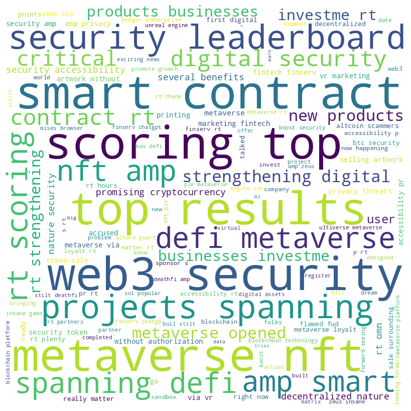

# MetaverseTwitterSentiments
 This is a concise sentimental analysis of "metaverse security" using Natural Language Processing (NLP) and scrapped tweets to evaluate positive, neutral, and negative opinions about metaverse security.

